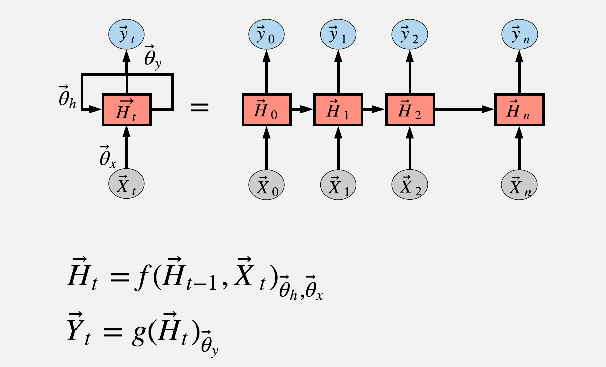
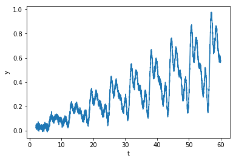

## LSTM Explained

The end goal of this document is to explain the Keras implementation of LSTM. I think there is no much information about the dimensions of the variables and the parameters involved in the creation of a LSTM model in keras. There is plenty of information about the theory of LSTM. There is also several examples of lstm implemented in keras but not about the connection between a simple feedforward neural network and a lstm. Why we want to understand the connection between lstm and a simple feed forward NN? Answer: in order to understand the true power (or lack of power) of the lstm. At the end, thanks to simple examples, I discovered that a simple feedforward NN is almost better than a LSTM. And thanks to a brief research of looking why is this the case I discovered that the LSTM is being replaced by better algorithms. You can read more about this in the following link:

- [Why the usage of LSTM is declining](https://towardsdatascience.com/the-fall-of-rnn-lstm-2d1594c74ce0)


### LSTM Review

LSTM stands for long short-term-memory. It is a type of recurrent neural network. A recurrent neural network can be explained with the following diagram:



The purpose of the training is to find all the &theta;<sub>x,y,h</sub>. The LSTM architecture differs from the tipical RNN in the following way:


There is plenty of information of why this recurrent architecture is better. The key improvement is that it can remember better by avoiding the exploding/vanishing gradients. You can read more about these concepts in the following links:

 - [Link to blog that explains lstm in depth](http://colah.github.io/posts/2015-08-Understanding-LSTMs/)
 - [Link to another nice lstm blog](https://skymind.ai/wiki/lstm)
 - [Link to wikipedia](https://en.wikipedia.org/wiki/Long_short-term_memory)
 
 

### Keras implementation

The serie that we use is the following:


It is a sum of sine functions with different frequencies plus a linear function plus gaussian noise.

Next we are going to build a LSTM model with 


    import numpy as np
    import matplotlib.pyplot as plt
    from keras.models import Sequential
    from keras.layers import Dense
    from keras.layers import LSTM
    import math
    from sklearn.metrics import mean_squared_error

    # fix random seed for reproducibility
    np.random.seed(7)
    x = np.linspace(2.0, 60.0, num=5000)
    y = (x/60.0)*(np.sin(x) + np.random.randn(5000)/10 + np.sin(2*x)/4 + np.sin(3*x)/2 + np.sin(4*x)/2 )/4 + x/100.0
    y = np.reshape(y,[len(y),1])
    dataset = y
   
    #split data
    train_size = int(len(dataset) * 0.67)
    test_size = len(dataset) - train_size
    train, test = dataset[0:train_size,:], dataset[train_size:len(dataset),:]
    print(len(train), len(test))	
    # convert an array of values into a dataset matrix
    def create_dataset(dataset, look_back=1):
	      dataX, dataY = [], []
	      for i in range(len(dataset)-look_back-1):
		        a = dataset[i:(i+look_back), 0]
		        dataX.append(a)
		        dataY.append(dataset[i + look_back, 0])
	      return np.array(dataX), np.array(dataY)
    # reshape into X=t and Y=t+1
    look_back = 1
    trainX, trainY = create_dataset(train, look_back)
    testX, testY = create_dataset(test, look_back)
    
    # reshape input to be [samples, time steps, features]
    trainX = np.reshape(trainX, (trainX.shape[0], 1, trainX.shape[1]))
    testX = np.reshape(testX, (testX.shape[0], 1, testX.shape[1]))
    
    model = Sequential()
    model.add(LSTM(4, input_shape=(1, look_back)))
    model.add(Dense(1))
    model.compile(loss='mean_squared_error', optimizer='adam')
    model.fit(trainX, trainY, epochs=10, batch_size=1, verbose=2)
    
    # make predictions
    trainPredict = model.predict(trainX)
    testPredict = model.predict(testX)
    # invert predictions
    testPredict1 = model.predict(testX[0:1,:,:])
    # calculate root mean squared error
    trainScore = math.sqrt(mean_squared_error(trainY[1:], trainPredict[:-1,0]))
    print('Train Score: %.2f RMSE' % (trainScore))
    testScore = math.sqrt(mean_squared_error(testY[1:], testPredict[:-1,0]))
    print('Test Score: %.2f RMSE' % (testScore))


h<sub>&theta;</sub>(x) = &theta;<sub>o</sub> x + &theta;<sub>1</sub>x


f the training is to find the 

h<sub>&theta;</sub>(x) = &theta;<sub>o</sub> x + &theta;<sub>1</sub>x


$E = mc^2$

```markdown
Syntax highlighted code block
h<sub>&theta;</sub>(x) = &theta;<sub>o</sub> x + &theta;<sub>1</sub>x
 # Header 1
 ## Header 2
 ### Header 3

- Bulleted
- List

1. Numbered
2. List

**Bold** and _Italic_ and `Code` text

[Link](url) and 
```

For more details see [GitHub Flavored Markdown](https://guides.github.com/features/mastering-markdown/).

### Jekyll Themes

Your Pages site will use the layout and styles from the Jekyll theme you have selected in your [repository settings](https://github.com/diegoorellanaga/LSTM/settings). The name of this theme is saved in the Jekyll `_config.yml` configuration file.

### Support or Contact

Having trouble with Pages? Check out our [documentation](https://help.github.com/categories/github-pages-basics/) or [contact support](https://github.com/contact) and we’ll help you sort it out.
